# Bug Bounty Operations - System Architecture

This document provides visual diagrams of the system architecture, process flows, and data relationships using Mermaid.

## 1. System Architecture Overview

## 2. Bug Bounty Process Flow

```mermaid
flowchart TD
    Start([User Initiates Scan]) --> ProgramSelect[Select Bug Bounty Program]
    ProgramSelect --> ValidateScope{Validate Scope & Permissions}
    
    ValidateScope -->|✅ Approved| CreateActivity[Create Activity Record]
    ValidateScope -->|❌ Denied| Reject[Reject - Out of Scope]
    
    CreateActivity --> InitFlow[Initialize Claude Flow Pipeline]
    
    subgraph "Claude Flow 6-Agent Pipeline"
        Coordination[🎯 Coordination Agent<br/>Scope validation, task planning]
        Recon[🔍 Reconnaissance Agent<br/>Asset discovery, enumeration]
        Analysis[🧠 Analysis Agent<br/>Vulnerability detection]
        ScannerFarm[⚙️ Scanner Farm Agent<br/>Automated testing tools]
        Exploitation[💥 Exploitation Agent<br/>Safe PoC generation]
        Reporting[📄 Reporting Agent<br/>Documentation & CVSS scoring]
    end
    
    InitFlow -.-> Coordination
    Coordination -.-> Recon
    Recon -.-> Analysis
    Analysis -.-> ScannerFarm
    ScannerFarm -.-> Exploitation
    Exploitation --> HumanGate{Human Review Required}
    
    HumanGate -->|✅ Approved| Reporting
    HumanGate -->|❌ Rejected| Archive[Archive Finding]
    HumanGate -->|🔄 Needs Changes| Exploitation
    
    Reporting -.-> AutoSubmit{Auto-Submit Enabled?}
    AutoSubmit -.->|Yes| SubmitPlatform[Submit to Platform]
    AutoSubmit -->|No| QueueReview[Queue for Manual Review]
    
    SubmitPlatform -.-> TrackPayout[Track Payout Status]
    QueueReview --> ManualSubmit[Manual Submission]
    ManualSubmit -.-> TrackPayout
    
    TrackPayout -.-> UpdateMetrics[Update Revenue Metrics]
    Archive --> UpdateMetrics
    UpdateMetrics --> End([Process Complete])
    
    style Coordination fill:#e3f2fd,stroke-dasharray: 5 5
    style Recon fill:#e8f5e8,stroke-dasharray: 5 5
    style Analysis fill:#fff3e0,stroke-dasharray: 5 5
    style ScannerFarm fill:#f3e5f5,stroke-dasharray: 5 5
    style Exploitation fill:#ffebee,stroke-dasharray: 5 5
    style Reporting fill:#e0f2f1,stroke-dasharray: 5 5
    style HumanGate fill:#fff8e1
    style AutoSubmit fill:#f3e5f5,stroke-dasharray: 5 5
    style SubmitPlatform fill:#f3e5f5,stroke-dasharray: 5 5
    style TrackPayout fill:#f3e5f5,stroke-dasharray: 5 5
```

## 3. Activity Tracking System (GitHub Actions Style)

```mermaid
graph TB
    subgraph "Activity Lifecycle"
        ActivityCreated[Activity Created<br/>📝 Queued Status]
        ActivityStarted[Activity Started<br/>⏯️ In Progress]
        
        subgraph "Job Execution"
            Job1[Job: Reconnaissance<br/>🔍 Asset Discovery]
            Job2[Job: Analysis<br/>🧠 Vuln Detection]
            Job3[Job: Exploitation<br/>💥 PoC Generation]
            Job4[Job: Reporting<br/>📄 Documentation]
        end
        
        ActivityComplete[Activity Complete<br/>✅ Success/❌ Failed]
    end
    
    subgraph "Data Tracking"
        Logs[(Activity Logs<br/>Timestamped Messages)]
        Artifacts[(Artifacts<br/>Evidence Files)]
        Runs[(Job Runs<br/>Step Details)]
        Status[(Status Updates<br/>Real-time Progress)]
    end
    
    subgraph "UI Components"
        ActivityList[📋 Activity History List<br/>Filterable & Searchable]
        ActivityDetail[🔍 Activity Detail View<br/>Jobs, Logs, Artifacts]
        JobExpansion[📊 Job Expansion<br/>Step-by-step execution]
        ArtifactViewer[📁 Artifact Viewer<br/>Evidence inspection]
    end
    
    ActivityCreated --> Job1
    Job1 --> Job2
    Job2 --> Job3
    Job3 --> Job4
    Job4 --> ActivityComplete
    
    Job1 -.-> Logs
    Job2 -.-> Logs
    Job3 -.-> Logs
    Job4 -.-> Logs
    
    Job1 -.-> Artifacts
    Job2 -.-> Artifacts
    Job3 -.-> Artifacts
    Job4 -.-> Artifacts
    
    Job1 -.-> Runs
    Job2 -.-> Runs
    Job3 -.-> Runs
    Job4 -.-> Runs
    
    ActivityStarted -.-> Status
    ActivityComplete -.-> Status
    
    Logs --> ActivityList
    Status --> ActivityList
    ActivityList --> ActivityDetail
    ActivityDetail --> JobExpansion
    ActivityDetail --> ArtifactViewer
    Artifacts --> ArtifactViewer
```

## 4. Data Flow Architecture

## 5. Human-in-the-Loop Integration Points

```mermaid
graph TD
    subgraph "Automated Pipeline"
        AutoScan[Automated Vulnerability Scan]
        AutoAnalysis[Automated Analysis]
        AutoPoC[Automated PoC Generation]
    end
    
    subgraph "Human Oversight Points"
        ReviewFindings{Review Findings<br/>Quality Check}
        ApproveSubmission{Approve Submission<br/>Platform Compliance}
        ValidateEvidence{Validate Evidence<br/>Proof Quality}
        AdjustSettings{Adjust Settings<br/>Rate Limits & Scope}
    end
    
    subgraph "UI Interfaces"
        WebDashboard[🌐 Web Dashboard<br/>Visual Review Interface]
        ClaudeChat[💬 Claude Code Chat<br/>Conversational Interface]
        MobileAlerts[📱 Mobile Alerts<br/>Push Notifications]
    end
    
    subgraph "Decision Support"
        RiskAssessment[Risk Assessment<br/>Impact Analysis]
        PayoutEstimate[Payout Estimation<br/>ROI Calculation]
        PlatformHistory[Platform History<br/>Success Rates]
        ComplianceCheck[Compliance Check<br/>Terms Validation]
    end
    
    AutoScan -.-> ReviewFindings
    AutoAnalysis -.-> ReviewFindings
    AutoPoC -.-> ValidateEvidence
    
    ReviewFindings -->|✅ Approve| ApproveSubmission
    ReviewFindings -->|❌ Reject| AdjustSettings
    ReviewFindings -->|🔄 Modify| AutoAnalysis
    
    ValidateEvidence -->|✅ Good| ApproveSubmission
    ValidateEvidence -->|❌ Insufficient| AutoPoC
    
    ApproveSubmission -.->|✅ Submit| AutoSubmit[Automated Submission]
    ApproveSubmission -->|❌ Hold| QueueManual[Manual Queue]
    
    WebDashboard --> ReviewFindings
    WebDashboard --> ApproveSubmission
    WebDashboard --> ValidateEvidence
    WebDashboard --> AdjustSettings
    
    ClaudeChat --> ReviewFindings
    ClaudeChat --> ApproveSubmission
    
    RiskAssessment -.-> ReviewFindings
    PayoutEstimate -.-> ApproveSubmission
    PlatformHistory -.-> ApproveSubmission
    ComplianceCheck -.-> ApproveSubmission
    
    style ReviewFindings fill:#fff3e0
    style ApproveSubmission fill:#e8f5e8
    style ValidateEvidence fill:#e3f2fd
    style AdjustSettings fill:#fce4ec
```

## 6. Claude Code MCP Integration

## 7. Deployment Architecture

## 8. Security & Compliance Flow

---

## Implementation Status Legend

**Solid lines (—)**: Fully implemented and functional
**Dotted lines (- - -)**: Not yet implemented (simulation/placeholder)
**Dashed borders**: Components that exist but need real implementation

## Current Implementation Status

### ✅ **Implemented & Working**
- **Web UI Dashboard** - Complete React interface with real-time updates
- **FastAPI Backend** - Full API with WebSocket support
- **MCP Server** - Claude Code integration with all tools/resources
- **Activity Tracking** - GitHub Actions-style workflow simulation
- **Container Infrastructure** - Docker compose with all services

### 🔄 **Partially Implemented (Simulation)**
- **Scan Orchestrator** - Framework exists, but uses hardcoded delays
- **Finding Manager** - Basic CRUD, but no real vulnerability detection
- **Evidence Store** - Structure in place, but no actual artifact generation

### ❌ **Not Yet Implemented**
- **Claude Flow Integration** - No connection to actual 6-agent pipeline
- **Bug Bounty Platform APIs** - No HackerOne/Bugcrowd integration
- **Security Tools** - No Nuclei, Burp Suite, or other scanner integration
- **Database Persistence** - Uses in-memory storage instead of PostgreSQL
- **Real Vulnerability Scanning** - All scanning is simulated

---

These diagrams provide comprehensive visualization of:

1. **System Architecture** - Overall component relationships
2. **Process Flow** - End-to-end bug bounty workflow
3. **Activity Tracking** - GitHub Actions-style execution tracking
4. **Data Flow** - Information movement through the system
5. **Human Integration** - Where human oversight is required
6. **MCP Integration** - Claude Code interface capabilities
7. **Deployment** - Container orchestration and infrastructure
8. **Security & Compliance** - Ethical and safe operation procedures

Each diagram can be rendered in any Markdown viewer that supports Mermaid, providing clear visual documentation for developers, stakeholders, and auditors.

**Development Strategy**: As components are implemented, their connecting lines should be changed from dotted (-.->)  to solid (-->) and their styling updated to remove the dashed borders.