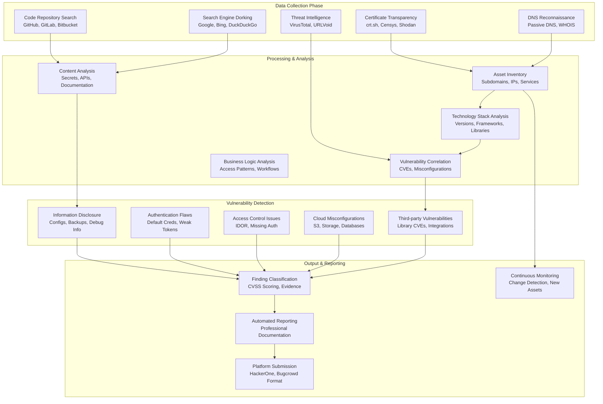

# Passive-Only Bug Bounty Scanning Pipeline

## Overview

A comprehensive passive reconnaissance and vulnerability discovery system that finds bugs without directly engaging target services. This approach minimizes legal risk while maximizing discovery potential through automated analysis of publicly available data.

## 🎯 Core Principles

- **Zero Direct Engagement** - Never directly contact target systems
- **Public Data Only** - Use certificate transparency, DNS, search engines, code repositories
- **Automated Scale** - Process thousands of assets simultaneously
- **High Signal-to-Noise** - Focus on actionable vulnerabilities
- **Legal Safety First** - All techniques use publicly available information

## 🏗️ Pipeline Architecture



## 📊 Data Sources & Techniques

### **Certificate Transparency Logs**
```python
# Primary asset discovery through CT logs
sources = [
    "crt.sh",           # Free CT log search
    "censys.io",        # Comprehensive certificate database  
    "shodan.io",        # Internet-wide scanning results
    "chaos.projectdiscovery.io",  # Community dataset
    "dnsdumpster.com"   # DNS reconnaissance
]

# Asset types discovered
asset_types = [
    "subdomains",       # *.target.com certificates
    "wildcard_domains", # Wildcard certificate coverage
    "internal_domains", # Accidentally exposed internal domains
    "ip_addresses",     # Certificate subject alternative names
    "organization_info" # Certificate organization details
]
```

### **DNS Reconnaissance (Passive)**
```python
# Passive DNS sources - no direct queries to target
passive_dns_sources = [
    "SecurityTrails",   # Historical DNS data
    "VirusTotal",       # Passive DNS intelligence
    "PassiveTotal",     # RiskIQ passive DNS
    "Farsight DNSDB",   # Professional DNS intelligence
    "AlienVault OTX"    # Open threat exchange
]

# DNS record types analyzed
dns_analysis = [
    "A/AAAA records",   # IP address mappings
    "CNAME records",    # Alias relationships
    "MX records",       # Email server configurations
    "TXT records",      # SPF, DKIM, domain verification
    "NS records",       # Name server analysis
]
```

### **Code Repository Mining**
```python
# Repository search targets
repo_sources = [
    "github.com",       # Public and leaked private repos
    "gitlab.com",       # GitLab public projects  
    "bitbucket.org",    # Atlassian repositories
    "gitea.io",         # Self-hosted Git services
    "pastebin.com"      # Code paste services
]

# Search patterns for vulnerabilities
search_patterns = [
    r"api[_-]?key\s*[:=]\s*['\"][a-zA-Z0-9]{20,}['\"]",     # API keys
    r"password\s*[:=]\s*['\"][^'\"]{8,}['\"]",               # Passwords
    r"secret[_-]?key\s*[:=]\s*['\"][a-zA-Z0-9]{32,}['\"]",  # Secret keys
    r"aws[_-]?access[_-]?key[_-]?id\s*[:=]\s*['\"][A-Z0-9]{20}['\"]",  # AWS keys
    r"-----BEGIN [A-Z ]+ KEY-----",                          # Private keys
    r"jdbc:mysql://[^/]+/[^?]+\?user=[^&]+&password=[^&]+",  # Database URLs
]
```

### **Search Engine Dorking**
```python
# Google dorking queries for information disclosure
google_dorks = [
    'site:{domain} filetype:env "DB_PASSWORD"',              # Environment files
    'site:{domain} "index of" "backup"',                     # Directory listings  
    'site:{domain} inurl:"/.git/" "parent directory"',       # Exposed .git
    'site:{domain} filetype:log "error" "stack trace"',      # Error logs
    'site:{domain} "api_key" OR "apikey" filetype:js',       # API keys in JS
    'site:{domain} "password" filetype:xlsx OR filetype:csv', # Credential files
    '"company internal" site:{domain}',                      # Internal documents
    'site:{domain} "swagger" OR "openapi" OR "api-docs"',    # API documentation
]

# Bing and DuckDuckGo variations  
search_engines = ["google", "bing", "duckduckgo", "yandex"]
```

## 🔍 Vulnerability Detection Modules

### **1. Information Disclosure Scanner**
```python
class InfoDisclosureScanner:
    def __init__(self):
        self.patterns = {
            'exposed_git': r'\.git/(config|logs|refs)',
            'backup_files': r'\.(backup|bak|old|tmp|swp)$',  
            'config_files': r'\.(env|config|ini|yaml|yml|json)$',
            'debug_files': r'(debug|trace|error)\.log$',
            'api_docs': r'/(docs|swagger|api-docs|redoc)/',
            'source_maps': r'\.js\.map$',
        }
    
    def scan_subdomain(self, subdomain):
        findings = []
        
        # Check for exposed files via search engines
        for vuln_type, pattern in self.patterns.items():
            dork_results = self.search_engine_dork(
                f'site:{subdomain} inurl:"{pattern}"'
            )
            
            for result in dork_results:
                findings.append({
                    'type': 'Information Disclosure',
                    'subtype': vuln_type,
                    'url': result['url'],
                    'severity': self.calculate_severity(vuln_type),
                    'evidence': result['snippet']
                })
        
        return findings
```

### **2. Authentication Flaw Detector**
```python
class AuthenticationFlawDetector:
    def __init__(self):
        self.default_creds = [
            ('admin', 'admin'),
            ('administrator', 'password'),
            ('root', ''),
            ('guest', 'guest'),
        ]
        
        self.weak_patterns = [
            r'session[_-]?id=\d+',              # Sequential session IDs
            r'token=[a-f0-9]{8}',               # Short hex tokens
            r'auth=[a-zA-Z0-9]{1,10}',          # Short auth tokens
        ]
    
    def analyze_authentication(self, asset):
        findings = []
        
        # Analyze documented APIs for auth weaknesses
        api_docs = self.find_api_documentation(asset)
        for doc in api_docs:
            auth_analysis = self.analyze_auth_documentation(doc)
            findings.extend(auth_analysis)
            
        # Check for default credential hints in documentation
        default_cred_findings = self.check_default_credentials(asset)
        findings.extend(default_cred_findings)
        
        return findings
```

### **3. Cloud Misconfiguration Detector**  
```python
class CloudMisconfigurationDetector:
    def __init__(self):
        self.cloud_services = {
            'aws_s3': r's3\.amazonaws\.com/([a-zA-Z0-9\-\.]+)',
            'gcp_storage': r'storage\.googleapis\.com/([a-zA-Z0-9\-\.]+)',
            'azure_blob': r'\.blob\.core\.windows\.net/([a-zA-Z0-9\-\.]+)',
            'digitalocean_spaces': r'\.digitaloceanspaces\.com/([a-zA-Z0-9\-\.]+)',
        }
    
    def scan_cloud_exposures(self, organization):
        findings = []
        
        # Search for cloud storage URLs in code repositories
        for service_name, pattern in self.cloud_services.items():
            search_results = self.code_repository_search(
                organization, pattern
            )
            
            for result in search_results:
                bucket_name = re.search(pattern, result['content']).group(1)
                
                # Check if bucket allows public listing (via search engines)
                public_check = self.check_public_bucket(service_name, bucket_name)
                
                if public_check:
                    findings.append({
                        'type': 'Cloud Misconfiguration',
                        'subtype': f'Public {service_name.upper()} Bucket',
                        'bucket_name': bucket_name,
                        'severity': 'High',
                        'evidence': result['content']
                    })
        
        return findings
```

### **4. Third-Party Vulnerability Correlator**
```python
class ThirdPartyVulnerabilityCorrelator:
    def __init__(self):
        self.cve_database = self.load_cve_database()
        self.js_library_patterns = {
            'jquery': r'jquery[/-](\d+\.\d+\.\d+)',
            'angular': r'angular[/-](\d+\.\d+\.\d+)', 
            'react': r'react[/-](\d+\.\d+\.\d+)',
            'vue': r'vue[/-](\d+\.\d+\.\d+)',
            'bootstrap': r'bootstrap[/-](\d+\.\d+\.\d+)',
        }
    
    def analyze_javascript_libraries(self, subdomain):
        findings = []
        
        # Find JavaScript files through search engines
        js_files = self.search_engine_dork(
            f'site:{subdomain} filetype:js'
        )
        
        for js_file in js_files:
            # Analyze file content for library versions
            content = self.fetch_content_safely(js_file['url'])
            
            for lib_name, version_pattern in self.js_library_patterns.items():
                match = re.search(version_pattern, content)
                if match:
                    version = match.group(1)
                    
                    # Check for known vulnerabilities
                    cves = self.check_cve_database(lib_name, version)
                    
                    for cve in cves:
                        findings.append({
                            'type': 'Third-party Vulnerability',
                            'library': lib_name,
                            'version': version,
                            'cve_id': cve['id'],
                            'severity': cve['severity'],
                            'description': cve['description'],
                            'evidence': js_file['url']
                        })
        
        return findings
```

## 📋 Implementation Phases

### **Phase 1: Asset Discovery Engine (Week 1-2)**
```python
# Core components to build first
components = [
    "Certificate Transparency collector",
    "Passive DNS aggregator", 
    "Subdomain deduplication system",
    "Asset inventory database",
    "Basic web interface for asset viewing"
]

# Expected output
phase_1_deliverables = [
    "Complete subdomain enumeration for target organizations",
    "Historical DNS data collection",
    "Technology stack fingerprinting",
    "Basic vulnerability correlation"
]
```

### **Phase 2: Code Repository Mining (Week 3-4)**
```python
# Repository analysis pipeline
repo_components = [
    "GitHub API integration with search",
    "Secret pattern detection engine",
    "Code analysis for API endpoints",
    "Configuration file parser",
    "Automated finding classification"
]

# Integration points
integrations = [
    "Asset inventory correlation",
    "Vulnerability severity scoring",  
    "Evidence collection and storage",
    "Reporting system integration"
]
```

### **Phase 3: Advanced Analysis (Week 5-6)**
```python
# Sophisticated analysis modules
advanced_components = [
    "Business logic vulnerability detection",
    "API security analysis",
    "Cloud misconfiguration detection",
    "Third-party dependency analysis", 
    "Continuous monitoring system"
]

# Output enhancement
enhancements = [
    "Professional report generation",
    "Platform-specific submission formatting",
    "False positive reduction",
    "Findings prioritization system"
]
```

## 🛡️ Safety & Compliance Features

### **Legal Protection Mechanisms**
```python
# Built-in safety features
safety_features = [
    "No direct target contact verification",
    "Public data source logging",
    "Rate limiting on all API calls", 
    "Comprehensive audit trails",
    "Data retention policies"
]

# Compliance monitoring
compliance_checks = [
    "Terms of service compliance verification",
    "Data source usage within limits",
    "No active scanning confirmation",
    "Evidence chain of custody",
    "Privacy-sensitive data filtering"
]
```

### **Quality Assurance**
```python
# False positive reduction
quality_measures = [
    "Multi-source verification",
    "Confidence scoring system",
    "Human validation queues",
    "Automated testing against known vulnerabilities",
    "Feedback loop for accuracy improvement"
]
```

## 📊 Expected Results

### **Bug Discovery Rates (Conservative Estimates)**
- **Information Disclosure**: 5-15 findings per 100 subdomains
- **Third-party Vulnerabilities**: 2-8 findings per 100 subdomains  
- **Cloud Misconfigurations**: 1-5 findings per 100 organizations
- **Authentication Flaws**: 1-3 findings per 100 applications
- **Total Expected**: 20-50 valid bugs per major organization

### **Time Investment**
- **Setup Time**: 40-60 hours initial development
- **Per-scan Runtime**: 2-4 hours for major organization
- **Manual Validation**: 30-60 minutes per finding
- **Report Generation**: 15-30 minutes per validated finding

### **Cost Structure**
- **API Costs**: $10-30 per scan (search engines, threat intel)
- **Infrastructure**: $20-50/month (storage, compute)
- **Tool Licenses**: $50-100/month (premium data sources)
- **Total Monthly**: $200-500 for heavy usage

## 🚀 Getting Started

### **Immediate Next Steps**
1. **Set up development environment** with required APIs
2. **Implement Certificate Transparency collector** as first component
3. **Build basic asset inventory** with web interface
4. **Create simple vulnerability detection** for information disclosure
5. **Test on known targets** with existing bug bounty programs

### **Success Metrics**
- **Asset Coverage**: 95%+ subdomain discovery vs manual reconnaissance
- **Finding Accuracy**: <10% false positive rate
- **Processing Speed**: <4 hours per major organization scan
- **Bug Validity**: >70% of submissions accepted by platforms

This passive-only approach provides a legally safe foundation for automated bug bounty operations while delivering significant value through comprehensive reconnaissance and analysis of publicly available data.