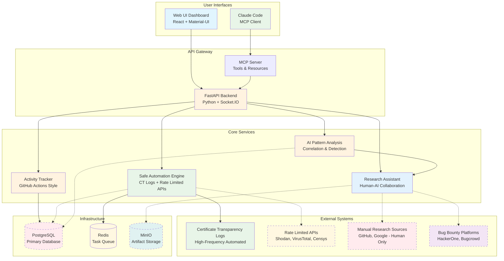
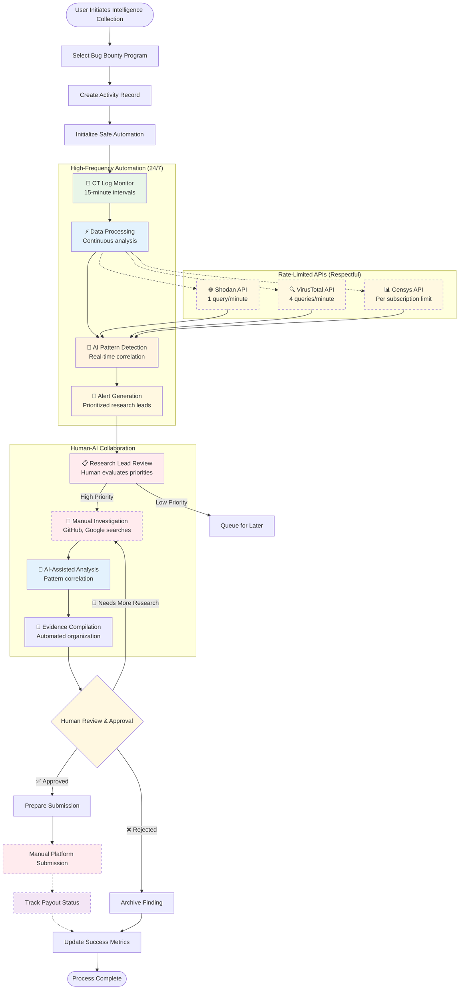
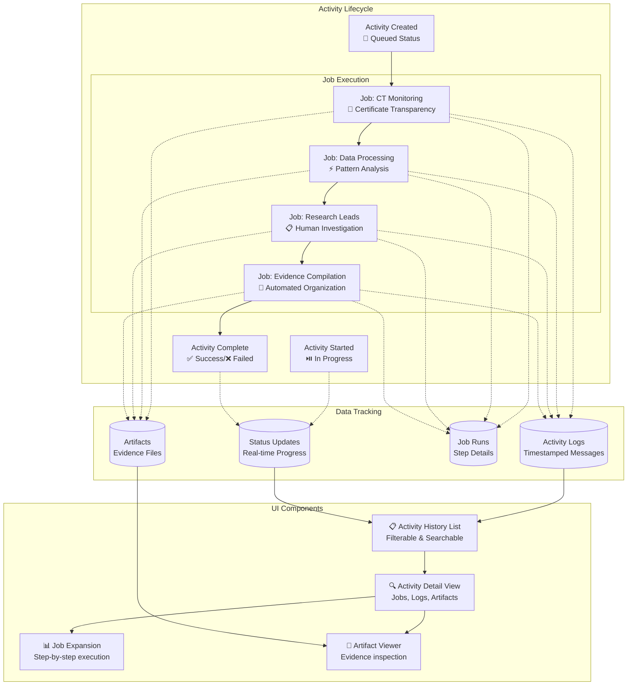
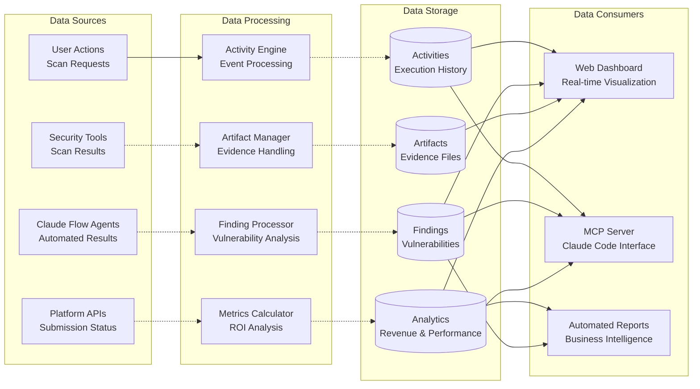
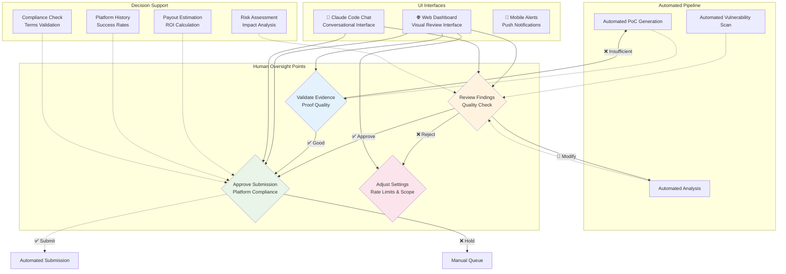
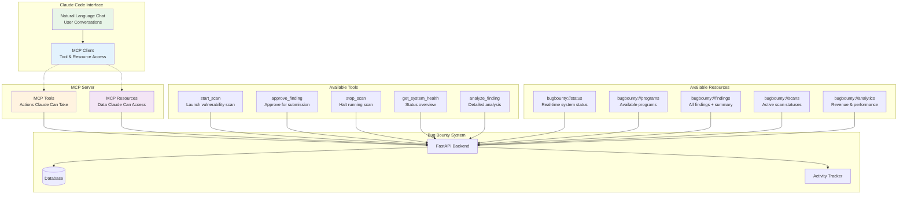
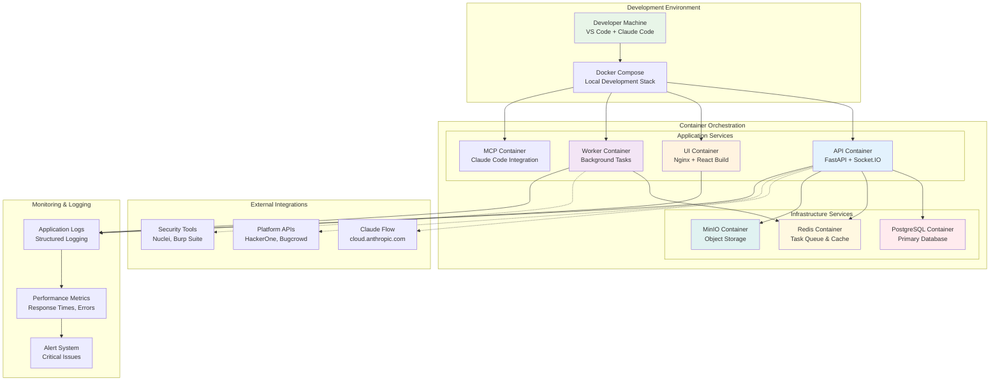
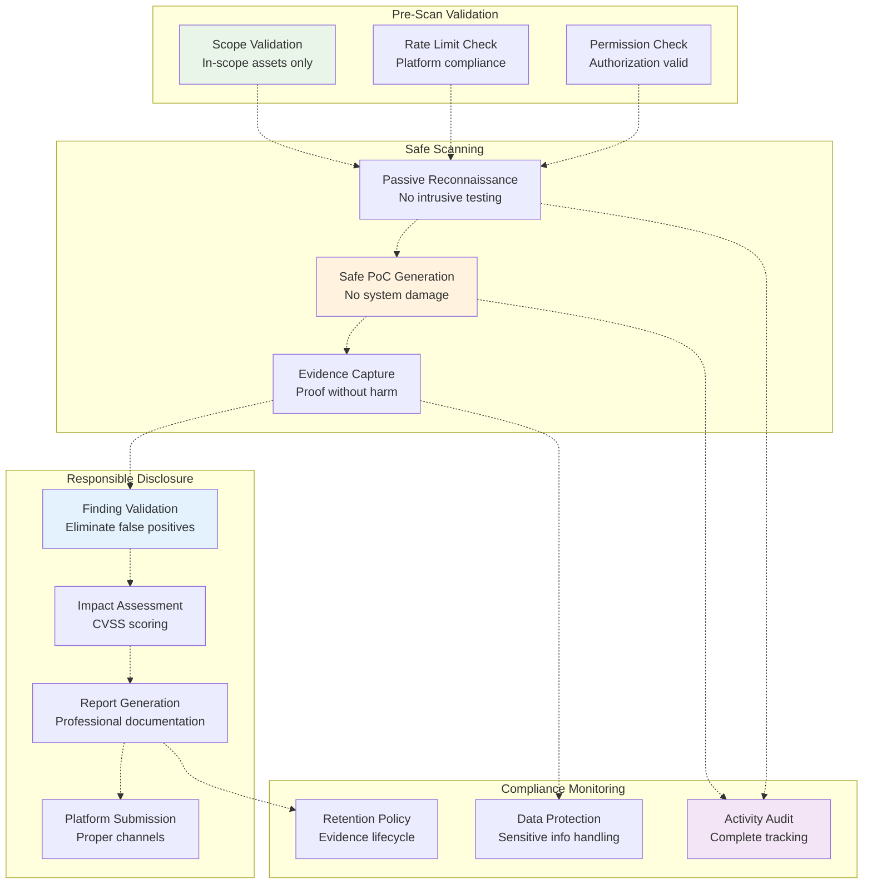

# Bug Bounty Operations - Safe Automation Architecture

This document provides visual diagrams of the safe automated intelligence collection system architecture, process flows, and data relationships using Mermaid.

## 1. System Architecture Overview

## 2. Safe Automation Process Flow

## 3. Activity Tracking System (GitHub Actions Style)

## 4. Data Flow Architecture

## 5. Human-in-the-Loop Integration Points

## 6. Claude Code MCP Integration

## 7. Deployment Architecture

## 8. Security & Compliance Flow

---

## Implementation Status Legend

**Solid lines (—)**: Fully implemented and functional
**Dotted lines (- - -)**: Not yet implemented (simulation/placeholder)
**Dashed borders**: Components that exist but need real implementation

## Current Implementation Status

### ✅ **Implemented & Working**
- **Web UI Dashboard** - Complete React interface with real-time updates
- **FastAPI Backend** - Full API with WebSocket support
- **MCP Server** - Claude Code integration with all tools/resources
- **Activity Tracking** - GitHub Actions-style workflow simulation
- **Container Infrastructure** - Docker compose with all services

### 🔄 **Ready for Safe Implementation**
- **CT Log Monitor** - Framework exists, needs real CT API integration
- **Pattern Analysis Engine** - Basic structure in place, needs AI correlation
- **Research Assistant Interface** - UI framework exists, needs AI suggestions
- **Rate Limiting System** - Framework in place, needs API integration

### ❌ **Not Yet Implemented (Safe Automation Components)**
- **Certificate Transparency Integration** - No real CT log processing
- **Respectful API Manager** - No rate-limited API calls (Shodan, VirusTotal)
- **AI Pattern Detection** - No automated vulnerability pattern recognition
- **Manual Research Workflow** - No human-AI collaboration interface
- **Evidence Compilation System** - No automated finding organization

---

These diagrams provide comprehensive visualization of:

1. **Safe Automation Architecture** - CT logs, rate-limited APIs, AI processing
2. **Intelligence Collection Flow** - High-frequency automation with human oversight
3. **Activity Tracking** - GitHub Actions-style execution tracking
4. **Data Flow** - Information movement through safe processing pipeline
5. **Human-AI Collaboration** - Where manual research is required
6. **MCP Integration** - Claude Code interface capabilities
7. **Deployment** - Container orchestration and infrastructure
8. **Legal Compliance** - Safe automation boundaries and audit trails

Each diagram can be rendered in any Markdown viewer that supports Mermaid, providing clear visual documentation for developers, stakeholders, and compliance auditors.

**Implementation Priority**: 
1. **Green components** (CT logs, AI processing) - Safe for high-frequency automation
2. **Yellow components** (rate-limited APIs) - Implement with careful rate limiting
3. **Red components** (manual research) - Human-initiated only, no automation