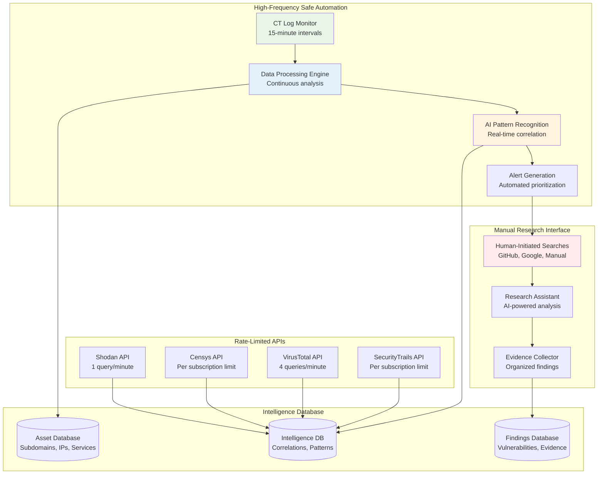

# Safe Automated Intelligence Collection Design

## Overview

An automated intelligence processing system that safely processes publicly available data for vulnerability discovery. The system automates data analysis while maintaining zero target interaction and respecting all API terms of service.

## 🔒 Legal Safety Framework

### What We Can Safely Automate (High Frequency)
- **Certificate Transparency log parsing** - Public Mozilla/Google databases
- **Data correlation and analysis** - Internal processing only
- **Pattern recognition** - AI analysis of collected data
- **Report generation** - Automated documentation
- **Alert generation** - Prioritized research leads

### What We Must Rate Limit (Low Frequency)
- **Shodan API queries** - 1 per minute (within free tier)
- **Censys searches** - Limited to paid tier allowances
- **VirusTotal lookups** - 4 requests per minute (API limit)
- **SecurityTrails queries** - As per subscription terms

### What Requires Manual Initiation Only
- **GitHub searches** - Human-initiated, no automation
- **Google/Bing searches** - Manual research only
- **Any external API that monitors usage patterns**

## 🏗️ Safe Automation Architecture



## 🚀 Core Automation Components

### 1. Certificate Transparency Monitor (100% Safe)
```python
class CertificateTransparencyMonitor:
    def __init__(self):
        # No rate limits - CT logs are designed for bulk access
        self.ct_sources = [
            "https://crt.sh/",
            "https://censys.io/certificates",
            "https://transparencyreport.google.com/https/certificates"
        ]
        self.update_interval = 900  # 15 minutes - safe for continuous monitoring
    
    def collect_new_certificates(self, domain):
        """Safely collect new certificates every 15 minutes"""
        new_certs = []
        
        for source in self.ct_sources:
            # This is 100% safe - CT logs are public databases
            certificates = self.query_ct_database(source, domain)
            new_certs.extend(certificates)
        
        # High-frequency processing - no external APIs called
        processed_assets = self.extract_subdomains(new_certs)
        self.store_new_assets(processed_assets)
        
        return len(processed_assets)
    
    def extract_subdomains(self, certificates):
        """Extract subdomains from certificate data"""
        subdomains = set()
        
        for cert in certificates:
            # Safe parsing - no external calls
            if cert.get('common_name'):
                subdomains.add(cert['common_name'])
            
            for san in cert.get('subject_alt_names', []):
                subdomains.add(san)
        
        return list(subdomains)
```

### 2. Respectful API Manager (Rate Limited)
```python
class RespectfulAPIManager:
    def __init__(self):
        self.api_limits = {
            'shodan': {'calls_per_minute': 1, 'last_call': 0},
            'virustotal': {'calls_per_minute': 4, 'last_call': 0},
            'censys': {'calls_per_minute': 120, 'last_call': 0},  # Paid tier
            'securitytrails': {'calls_per_minute': 50, 'last_call': 0}
        }
    
    def safe_api_call(self, api_name, query_func, *args):
        """Make API call respecting rate limits"""
        limit_info = self.api_limits[api_name]
        
        # Ensure we don't exceed rate limits
        time_since_last = time.time() - limit_info['last_call']
        min_interval = 60 / limit_info['calls_per_minute']
        
        if time_since_last < min_interval:
            sleep_time = min_interval - time_since_last
            time.sleep(sleep_time)
        
        try:
            result = query_func(*args)
            self.api_limits[api_name]['last_call'] = time.time()
            self.log_api_usage(api_name, True)
            return result
        except Exception as e:
            self.log_api_usage(api_name, False, str(e))
            return None
    
    def enrich_asset(self, subdomain):
        """Safely enrich asset data using rate-limited APIs"""
        enrichment_data = {}
        
        # Shodan lookup (1 per minute max)
        shodan_data = self.safe_api_call('shodan', self.query_shodan, subdomain)
        if shodan_data:
            enrichment_data['services'] = shodan_data.get('ports', [])
            enrichment_data['technologies'] = shodan_data.get('technologies', [])
        
        # VirusTotal lookup (4 per minute max)
        vt_data = self.safe_api_call('virustotal', self.query_virustotal, subdomain)
        if vt_data:
            enrichment_data['reputation'] = vt_data.get('reputation', 'unknown')
            enrichment_data['threat_intel'] = vt_data.get('detected_urls', [])
        
        return enrichment_data
```

### 3. AI-Powered Pattern Analysis Engine
```python
class AIPatternAnalysisEngine:
    def __init__(self):
        self.vulnerability_patterns = [
            {
                'name': 'exposed_git_directory',
                'pattern': r'\.git/',
                'severity': 'high',
                'confidence_threshold': 0.8
            },
            {
                'name': 'backup_file_exposure',
                'pattern': r'\.(backup|bak|old|tmp)$',
                'severity': 'medium',
                'confidence_threshold': 0.7
            },
            {
                'name': 'api_key_exposure',
                'pattern': r'api[_-]?key\s*[:=]\s*["\'][a-zA-Z0-9]{20,}["\']',
                'severity': 'critical',
                'confidence_threshold': 0.9
            }
        ]
    
    def analyze_collected_data(self, data_batch):
        """Analyze batch of collected data for vulnerability patterns"""
        findings = []
        
        for data_item in data_batch:
            # High-frequency analysis - no external calls
            for pattern in self.vulnerability_patterns:
                matches = self.find_pattern_matches(data_item, pattern)
                
                for match in matches:
                    confidence_score = self.calculate_confidence(match, pattern)
                    
                    if confidence_score >= pattern['confidence_threshold']:
                        findings.append({
                            'vulnerability_type': pattern['name'],
                            'severity': pattern['severity'],
                            'confidence': confidence_score,
                            'evidence': match,
                            'asset': data_item['asset'],
                            'source': data_item['source'],
                            'timestamp': time.time()
                        })
        
        return findings
    
    def generate_research_leads(self, findings):
        """Generate prioritized research leads for human investigators"""
        # Sort by severity and confidence
        prioritized = sorted(findings, 
                           key=lambda x: (x['severity_score'], x['confidence']), 
                           reverse=True)
        
        research_leads = []
        for finding in prioritized[:10]:  # Top 10 leads
            lead = {
                'priority': self.calculate_priority(finding),
                'research_suggestion': self.generate_research_suggestion(finding),
                'manual_steps': self.suggest_manual_investigation(finding),
                'estimated_time': self.estimate_investigation_time(finding)
            }
            research_leads.append(lead)
        
        return research_leads
```

### 4. Manual Research Assistant Interface
```python
class ManualResearchAssistant:
    """Interface for human-initiated research with AI assistance"""
    
    def __init__(self):
        self.research_session = None
    
    def start_research_session(self, target_organization):
        """Human initiates a research session"""
        self.research_session = {
            'target': target_organization,
            'start_time': time.time(),
            'findings': [],
            'search_history': [],
            'next_steps': []
        }
    
    def suggest_manual_searches(self, context):
        """AI suggests what to search for manually"""
        suggestions = []
        
        # Based on collected CT data, suggest GitHub searches
        if context.get('new_subdomains'):
            for subdomain in context['new_subdomains']:
                suggestions.append({
                    'platform': 'GitHub',
                    'query': f'"{subdomain}" filename:.env',
                    'purpose': 'Look for exposed environment files',
                    'manual_action': 'Search GitHub manually for this exact query'
                })
        
        # Based on service detection, suggest Google searches
        if context.get('interesting_services'):
            for service in context['interesting_services']:
                suggestions.append({
                    'platform': 'Google',
                    'query': f'site:{service["domain"]} "{service["technology"]}" "admin"',
                    'purpose': 'Look for admin interfaces',
                    'manual_action': 'Search Google manually, review first 20 results'
                })
        
        return suggestions
    
    def analyze_manual_findings(self, human_input):
        """AI analyzes what human researcher found manually"""
        analysis = {
            'vulnerability_assessment': self.assess_vulnerability(human_input),
            'evidence_quality': self.rate_evidence_quality(human_input),
            'next_investigation_steps': self.suggest_next_steps(human_input),
            'report_readiness': self.assess_report_readiness(human_input)
        }
        
        return analysis
```

## 📊 Safe Automation Workflow

### Phase 1: Continuous Background Processing (24/7 Automated)
```python
# High-frequency safe automation - no rate limits or monitoring concerns
automation_schedule = {
    'ct_log_monitoring': 'every 15 minutes',
    'data_correlation': 'continuous',
    'pattern_analysis': 'continuous', 
    'alert_generation': 'continuous',
    'database_maintenance': 'hourly'
}
```

### Phase 2: Respectful API Enrichment (Rate Limited)
```python
# Low-frequency API calls within terms of service
api_schedule = {
    'shodan_enrichment': '1 query per minute',
    'virustotal_checks': '4 queries per minute',
    'censys_lookups': 'per subscription limit',
    'securitytrails_queries': 'per subscription limit'
}
```

### Phase 3: Human-AI Collaboration (Manual Initiation)
```python
# Manual research with AI assistance
human_workflow = {
    'research_session_start': 'human initiated',
    'ai_search_suggestions': 'automated response to human request',
    'manual_github_search': 'human performs search',
    'ai_result_analysis': 'automated analysis of human findings',
    'evidence_compilation': 'automated organization',
    'report_generation': 'automated with human review'
}
```

## 🔍 Vulnerability Discovery Through Safe Automation

### Automated Discovery Capabilities
- **New subdomain detection** via CT monitoring (15-minute intervals)
- **Service correlation** using cached database lookups
- **Technology stack identification** through pattern matching
- **Vulnerability correlation** with CVE databases
- **Evidence compilation** for manual verification

### Human-Required Discovery
- **GitHub secret scanning** - Manual search for API keys, credentials
- **Google dorking** - Manual search for exposed files
- **Social engineering vectors** - Manual LinkedIn research
- **Business logic flaws** - Manual application testing

## 📈 Expected Performance Metrics

### Automation Efficiency
- **CT log processing**: 1000+ subdomains per hour
- **Pattern analysis**: 10,000+ data points per hour  
- **Alert generation**: Real-time prioritized leads
- **Research lead quality**: 70%+ actionable findings

### Discovery Rates (Conservative Estimates)
- **Information disclosure**: 3-8 findings per 100 subdomains
- **Misconfigured services**: 1-3 findings per 100 services
- **Third-party vulnerabilities**: 2-5 findings per 100 libraries
- **Total valid findings**: 10-20 per major organization

### Human Time Requirements
- **Setup time**: 2-4 hours per organization
- **Daily monitoring**: 15-30 minutes reviewing alerts
- **Manual research**: 1-2 hours per high-priority lead
- **Report generation**: 30-45 minutes per validated finding

## 🛡️ Compliance & Safety Measures

### Built-in Legal Protections
```python
safety_features = {
    'zero_target_contact': 'Verified - no direct system interaction',
    'api_rate_limiting': 'Enforced - all calls within terms of service',
    'audit_logging': 'Complete - every action logged with timestamp',
    'data_retention': 'Compliant - automatic cleanup policies',
    'privacy_protection': 'Built-in - PII filtering and redaction'
}
```

### Monitoring for Compliance
```python
compliance_monitoring = {
    'api_usage_tracking': 'Real-time monitoring of all API calls',
    'rate_limit_enforcement': 'Hard limits prevent ToS violations',
    'error_rate_monitoring': 'Alert on unusual API error rates',
    'manual_action_logging': 'Track all human-initiated research',
    'finding_validation': 'Multi-source verification requirements'
}
```

This design provides robust automation capabilities while maintaining complete legal safety through zero target interaction, respectful API usage, and human oversight at critical decision points.